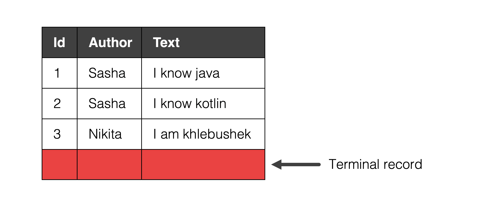
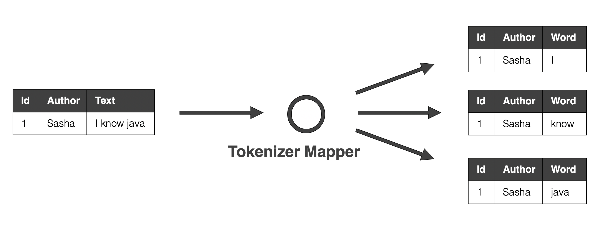
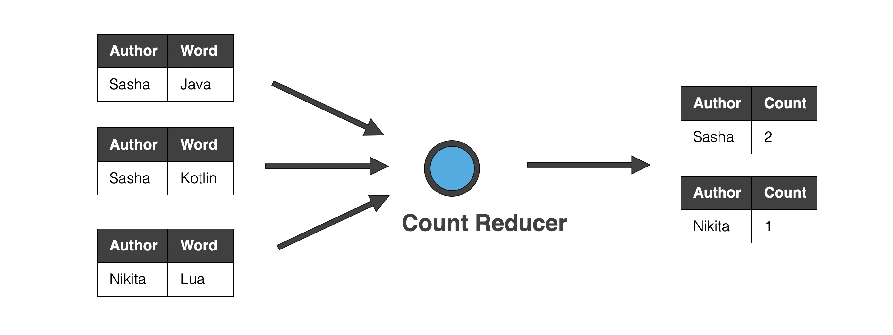
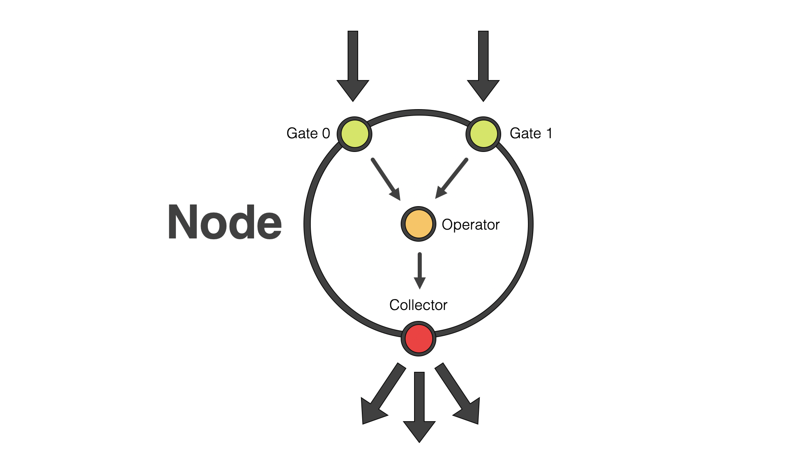
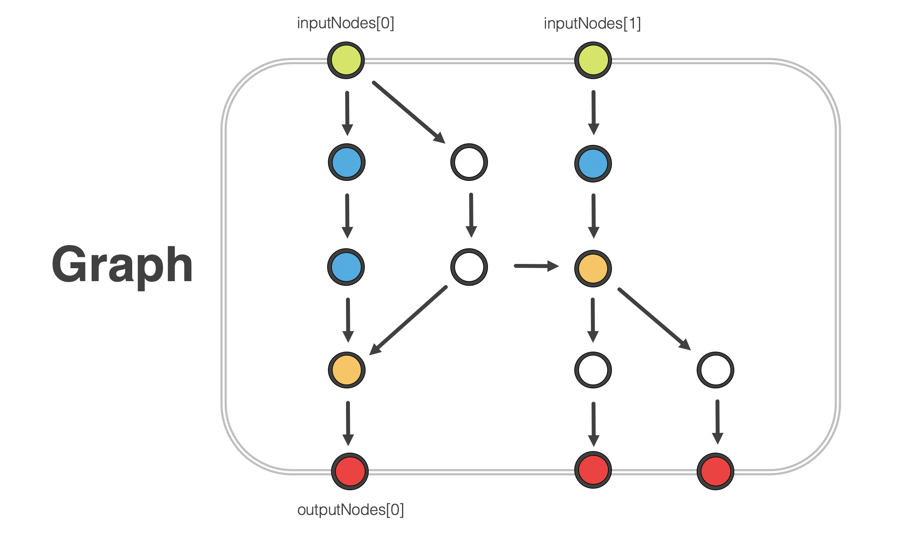
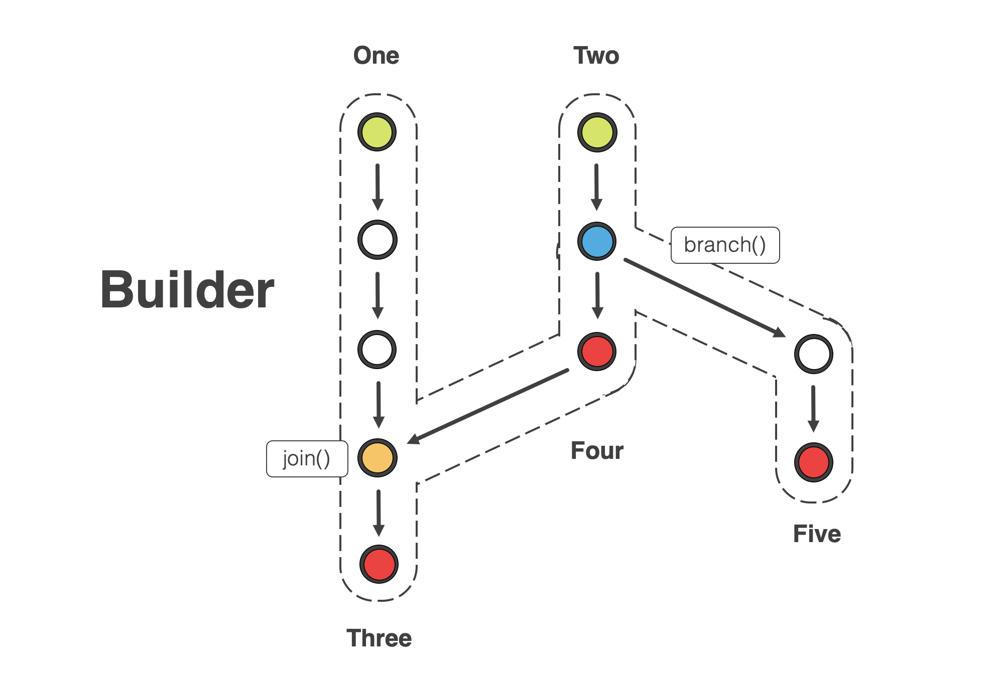
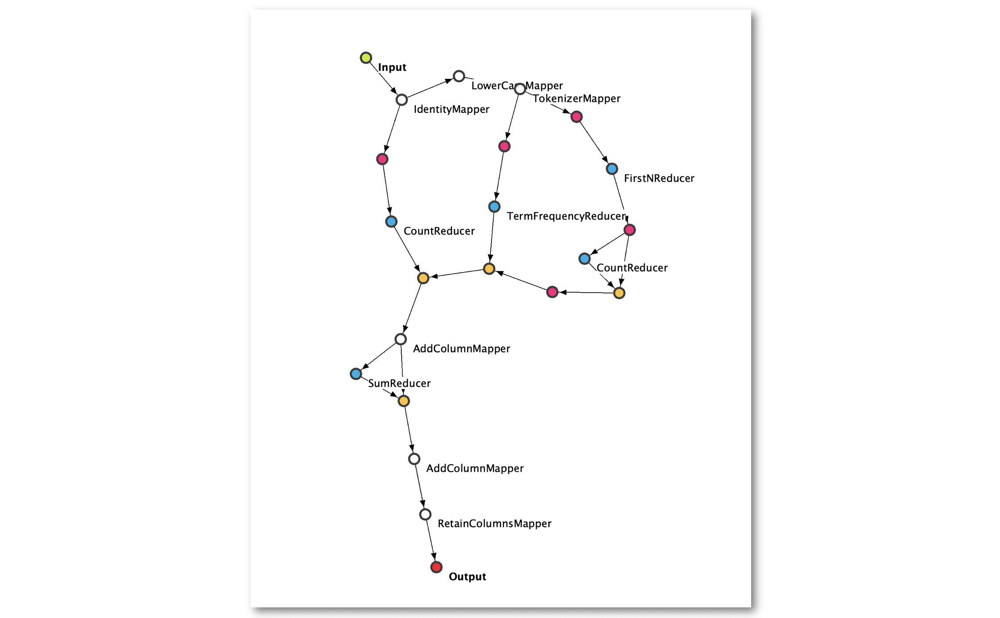

# Stream processing graph

## What it is and why do I need it?

Processing (also known as **computational**) graph is a sequence of operations which transforms input data in a desired way.       

The most important advantage is the ability to separate the **description** of operations from their **execution**. It allows to describe the logic once and then launch it in different environments:
* On a user machine / remote machine.
* Using single thread / multiple threads.
* Using multiple machines.     

## Main concepts

### Record, Stream and Dataset

**Record** is a group of key-value pairs. It represents a single unit of data - info about one person, one document, etc. In our project it is implemented by [Record](src/main/java/io/github/javaasasecondlanguage/homework04/Record.java) class. 


A sequence of records is called **Stream**. Processing graph can accept stream of records as input, transform records one by one and then output them as a new stream.  

Streams can represent one of the two different concepts:
* Infinite sequence of records, which are generated in real time. For example, clicks on items in the online store. You can never hope to see "all" such records, because they continue to arrive again and again. 
* Finite sequence of records. For example, contents of all documents currently present in a library. We call such finite sequence **Dataset**. 

In order to mark the end of a dataset, we can insert a so called **terminal record**.     



### Operator

**Operators** represent basic actions, which transform records in some way. They can be chained together in order to implement a graph with a desired logic.

Operator accepts records one at a time. Each time it can output either zero, one or more records (by passing them to `collector` object). Operator can store any info about previously seen rows inside itself.      

Operators can be roughly divided into two types: mappers and reducers.

#### Mapper

Mapper operator accepts a single record and outputs one or more new records. All mappers must implement [Mapper](src/main/java/io/github/javaasasecondlanguage/homework04/ops/Mapper.java) interface.



One mapper is already implemented: [IdentityMapper](src/main/java/io/github/javaasasecondlanguage/homework04/ops/mappers/IdentityMapper.java).

#### Reducer

Reducer operator accepts sequence of records, which split into groups by key. All reducers must implement [Reducer](src/main/java/io/github/javaasasecondlanguage/homework04/ops/Reducer.java) interface.



One reducer is already implemented: [CountReducer](src/main/java/io/github/javaasasecondlanguage/homework04/ops/reducers/CountReducer.java), use it as example.


### Node

Each operator is contained inside a [ProcNode](src/main/java/io/github/javaasasecondlanguage/homework04/nodes/ProcNode.java) object. Node handles all communication with the outside world: 
* It accepts records from the previous nodes.
* Preprocesses records if needed.
* Passes records to operator.
* Collects its outputs.
* Passes these outputs to the next nodes.

Each node has several input **gates**, which allows it to accept different streams of records (this is used in join operations, for example).  
   


Nodes can be divided into four types:
* [MapperNode](src/main/java/io/github/javaasasecondlanguage/homework04/nodes/MapperNode.java) skips terminal records. When a terminal record arrives, it is simply redirected to the next node without any processing.
* [ReducerNode](src/main/java/io/github/javaasasecondlanguage/homework04/nodes/ReducerNode.java) does not skip terminal records. It accepts **sorted** sequence of records and groups them by specified keys.
* [SorterNode](src/main/java/io/github/javaasasecondlanguage/homework04/nodes/SorterNode.java) does not uses operator. It accepts records and stores them inside itself until it receives a terminal record. Then it sorts all stored records and outputs them.
* [JoinerNode](src/main/java/io/github/javaasasecondlanguage/homework04/nodes/JoinerNode.java) does not uses operator. It accepts inputs from two gates (0 and 1) and outputs joined rows. You will have to implement it.
   
  

### Graph

[ProcGraph](src/main/java/io/github/javaasasecondlanguage/homework04/ProcGraph.java) object represents the actual processing graph - a group of interconnected nodes. It exposes its input nodes and output nodes.  
 


### Graph part builder

Since graph is a non-linear data structure, it is difficult to create a convenient API for assembling a new graph. In this project we solve this problem by using a [GraphPartBuilder](/src/main/java/io/github/javaasasecondlanguage/homework04/GraphPartBuilder.java). Each builder instance tracks the first and the last node of some linear part of the graph. You can do three basic actions with a builder:

* Append a new node to the current linear part (by using `map`, `reduce` and so on).
* Merge with another linear part, which is represented by another builder (by using `join`).
* Split a new linear part, creating a new builder (by using `branch`).  
  
  For the example of using builder see code in [WordCount](src/main/java/io/github/javaasasecondlanguage/homework04/graphs/WordCount.java).
  


## Our project

We have a single-module gradle project. It includes a lot of things:
* All basic classes in the [root](src/main/java/io/github/javaasasecondlanguage/homework04) package.
* Different node types (one not implemented), in package [nodes](src/main/java/io/github/javaasasecondlanguage/homework04/nodes).
* Different operators (most of them not implemented), in package [operators](src/main/java/io/github/javaasasecondlanguage/homework04/operators).
* Different graphs (only one implemented), in package  [graphs](src/main/java/io/github/javaasasecondlanguage/homework04/graphs).
* Utilities for visualizing graphs in package [ui](src/main/java/io/github/javaasasecondlanguage/homework04/ui). 

### Visualization

Our project includes tools for visualizing processing graphs you have created. It uses a well-known graph library [GraphStream](https://graphstream-project.org/). All code is located in [ui](src/main/java/io/github/javaasasecondlanguage/homework04/ui) package.

**How to use it**: simply pass your `ProcGraph` object to the method `GraphVisualizer.visualizeGraph`. It will open a Swing UI window which contains your graph. You may do it inside class [VisualizationDemo](src/test/java/io/github/javaasasecondlanguage/homework04/VisualizationDemo.java) (remove `@Disabled` annotation first). You will see something like this:


 
All nodes are colour coded:
* Inputs: green
* Outputs: red
* Mappers: white
* Reducer: blue
* Sorters: violet
* Joiners: orange

## Your task

Your task can be divided into two parts:
* Develop a "toolbox" of operators and nodes. 
* Use it to assemble processing graphs for solving actual practical problems.

### Operators toolbox

You must implement the following operators (and pass tests for them):
* Mappers
    - [AddColumnMapper](src/main/java/io/github/javaasasecondlanguage/homework04/ops/mappers/AddColumnMapper.java)
    - [FilterMapper](src/main/java/io/github/javaasasecondlanguage/homework04/ops/mappers/FilterMapper.java)
    - [LowerCaseMapper](src/main/java/io/github/javaasasecondlanguage/homework04/ops/mappers/LowerCaseMapper.java)
    - [RetainColumnsMapper](src/main/java/io/github/javaasasecondlanguage/homework04/ops/mappers/RetainColumnsMapper.java)
    - [TokenizerMapper](src/main/java/io/github/javaasasecondlanguage/homework04/ops/mappers/TokenizerMapper.java)
* Reducers
    - [FirstNReducer](src/main/java/io/github/javaasasecondlanguage/homework04/ops/reducers/FirstNReducer.java)
    - [SumReducer](src/main/java/io/github/javaasasecondlanguage/homework04/ops/reducers/SumReducer.java)
    - [WordFrequencyReducer](src/main/java/io/github/javaasasecondlanguage/homework04/ops/reducers/WordFrequencyReducer.java)
* Nodes
    - [JoinerNode](src/main/java/io/github/javaasasecondlanguage/homework04/nodes/JoinerNode.java)
    
### Practical problems

#### Problem 0: Word Count

* **Task**: Count how much words each author has written
* **Input**: stream of records like:
    ```json
    {"Id": 1, "Author": "Caesar", Text: "Et tu, Brute"}
    ```
* **Output**: stream of records like:
    ```json
    {"Author": "Caesar", "TotalWords": 420}
    ```
  Records should be sorted by Author column, ascending. 

Graph for this task is already implemented in a class [WordCount](src/main/java/io/github/javaasasecondlanguage/homework04/graphs/WordCount.java), but some operators are not implemented yet. You must implement these operators (as part of task "Operators toolbox") and pass the tests in [WordCountTest](src/test/java/io/github/javaasasecondlanguage/homework04/graphs/WordCountTest.java). 

#### Problem 1: to be done

## Score

## Build and test
 