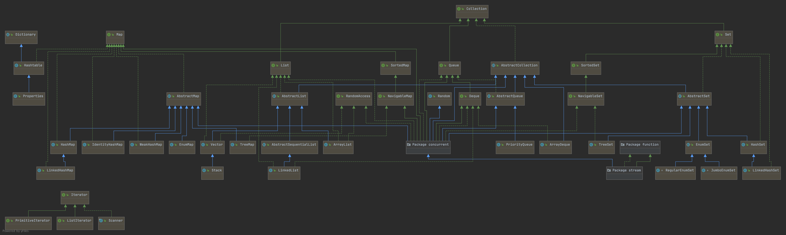

## Java As A Second Language
### Lecture 03
### Collections, Generics, Streams


--- 
# Homework 2. Q/A


---
# Collections
- **[Collections]**
- List
- Generics
- Map and Set
- Stream API

---
# Java collections
Java collections zoo

---

## List
- Collections
- **[List]**
- Generics
- Map and Set
- Stream API
---

## ArrayList
Auto-resizeable array

```java
var l1 = new ArrayList<String>();
var ships = List.of<String>("Boeotians", "Minyans", "Phocēans"); //unmodifiable list
```
---

## ArrayList. Internals #1

```java
List<String> list = new ArrayList<>();
```


```java
list.add("0");
list.add("1");
```


---
### ArrayList. Internals #2
```java
list.addAll(Arrays.asList("2", "3", "4", "5", "6", "7", "8"));
list.add("9");
```


---
### ArrayList. Internals #3
```java
list.add("10");
```
Not enough capacity. Need (auto)resize.


---
## Quiz
### What is the difference between capacity and size in `ArrayList`?

---

## ArrayList. Complexity

|  contains  | add   | get   |  set  | remove | 
|:----------:|:-----:|:-----:|:-----:|:------:|
| O(n)       | O(1)* |  O(1) |  O(1) | O(n)   |

* Amortized complexity. How to implement List that has O(1) on add()?
---

## LinkedList
- Doubly-linked list implementation of the **List** and **Deque**
interfaces.

---
## LinkedList internals #1
```java
var list = new LinkedList<>();
```


---
## LinkedList internals #2
```java
list.add("0");
```

Allocation


Linking


---
## LinkedList internals #3
```java
list.add("1");
```

Allocation


Linking


---
## LinkedList. Complexity

|  contains  | add   | get   |  set  | remove | 
|:----------:|:-----:|:-----:|:-----:|:------:|
| O(n)       | O(1)  |  O(n) |  O(n) | O(n)   |

---

## Generics
- Collections
- List
- **[Generics]**
- Map and Set
- Stream API

---
## Generic list
```java
var intList = new ArrayList<Integer>();
List\<String\> strList = new ArrayList<>();
```
You can not add String to this array anymore

---
## Generics 
Generics give developer more type safety in compile time   
See: GenericVsRawType

---
## How to create generic class/method?
See collections framework

---
# Practice 1. Implement stack


---

## Generics are compile-time
Generics only hold on compile-time (non reified)  
That means that your code cannot know the Class of generic from code  
Why?  
@See ImpossibleWithGenerics

---

## Terms

|  Term  | Example   |
|:----------:|:-----:|
| List<String>      | Parameterized type |
| String | Actual type parameter |
| List<E> | Generic type |
| E | Formal type parameter |
| List<?> | Unbounded wildcard type |

---
## Terms...
|  Term  | Example   |
|:----------:|:-----:|
| List | Raw type |
| <E extends Number> | Bounded type parameter |
| static <E> List<E> asList(E[] a)| Recursive type bound |
| String.class| Bounded wildcard type |
| Item | Generic method |

---
## Type Erasure
Generics were added to Java to ensure type safety and to ensure that generics wouldn't cause overhead at runtime.  
The compiler applies a process called type erasure on generics at compile time.  
  
---
## Type Erasure...
Type erasure removes all type parameters and replaces it with their bounds or with Object if the type parameter is unbounded.  
Thus the bytecode after compilation contains only normal classes, interfaces and methods thus ensuring that no new types are produced. Proper casting is applied as well to the Object type at compile time.
[For backward compatibility with programs written for Java<5](https://docs.oracle.com/javase/specs/jls/se14/html/jls-4.html#jls-4.7)

---
## Generics are invariant, arrays are covariant
@See ArrayVsList

---
## Generics are compile-time, arrays are reified
Reified types are those that available at runtime  
[JLS 4.7](https://docs.oracle.com/javase/specs/jls/se14/html/jls-4.html#jls-4.7)
---

## Lists vs Arrays
Arrays are covariant  
if Sub is a subtype of Super,  
then the array type Sub[] is a subtype of the array type Super[]  
Generics are invariant: for any two distinct types Type1 and Type2, List<Type1>  
is neither a subtype nor a supertype of List<Type2>

---
## Generics vs C++ Templates
Templates are much more powerful  
Generics are only compile time sugar


---
## Bounded generics
What if I want to work with List<Integer> as with List<Number>  
Or you do not care about type

@See BoundedGenerics

---
# Practice 2. Implement set intersection

---
# Map/Set
- Collections
- List
- Generics
- **[Map and Set]**
- Stream API

---
### Complexity
HashMap

|  containsKey  | get   | put   | remove | 
|:----------:|:-----:|:-----:|:------:|
| O(1)       | O(1)  |  O(1) | O(1)  |


TreeMap

|  containsKey  | get   | put   | remove |
|:----------:|:-----:|:-----:|:------:|
| O(log(n))       | O(log(n))  |  O(log(n)) | O(log(n))  |

[Read more](http://infotechgems.blogspot.ru/2011/11/java-collections-performance-time.html)


---
## HashMap. Internals 


---
## Quiz - how can you resolve collisions

---
## Quiz
[How](http://hg.openjdk.java.net/jdk8u/jdk8u/jdk/file/a006fa0a9e8f/src/share/classes/java/util/HashMap.java#l1876
) does HashMap make a tree of items if they are not comparable?

---
### equals/hashCode/compareTo contract
**To use HashMap - you must have consistent equals/hashCode and compareTo for keys**  
For objects **a** and **b**:
```java
a.equals(b) => a.hashCode() == b.hashCode()

if a.hashCode() == b.hashCode() 
          a may be not equal b
          
a.hashcode() is the same during object lifetime
```

---
## Practice 3. Implement LRU Cache

---
## Stream API
- Collections
- List
- Generics
- Map and Set
- **[Stream API]**

---
## Loops good

```java
 var filtered = new ArrayList<>();
 for(Person p : people) {
     if(p.age() < 19) {
         filtered.add(p);
     }
 }
 return filtered;
```

---
## Streams good

```java
 return people
     .filter( p -> p.age() < 19)
     .collect(toList());
```

---
## Operations

1. Intermediate
2. Terminal
    - allMatch() operation
    - anyMatch() operation
    - noneMatch() operation
    - collect() operation
    - count() operation
    - forEach() operation
    - min() operation
    - max() operation
    - reduce() operation
3. Debug*
    - peek()


---
## Tell me more

Let's pretend Java is ~~Haskell~~ a functional language.

Stream is an abstraction. Not a data structure.

---
## Practice 4. Streams & LocationService

---
## TIL
- List is a resizeable wrapper for array
- LinkedList ~~sucks~~ is a double-linked list
- HashMap is fast for retrieval
- you must implement consistent equals()/hashCode()/compareTo() for keys of HashMap
- Generics allow you to have move type safety in compile time
- Generics are only compile-time feature
- Use bounded generics to make your API mor flexible
- Streams are cool